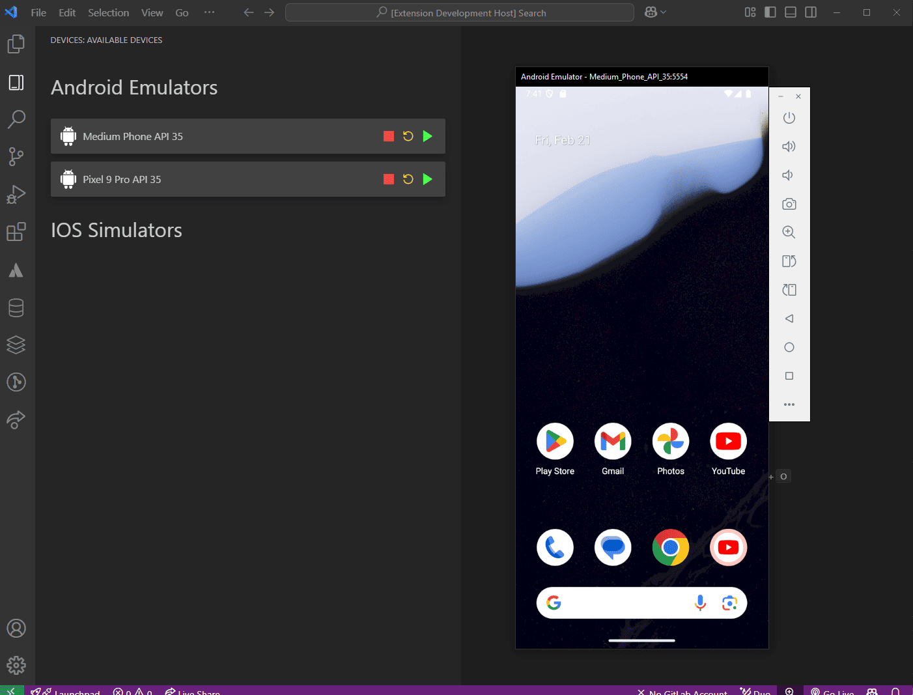

# Android iOS Emulator Launcher

A VS Code extension to launch Android and iOS emulators directly from the editor.

## Features

- **List Available Emulators/Simulators**
- **Start, Kill, or Cold Boot Devices**
- **Supports Android Emulators & iOS Simulators**

## Installation

1. Install the extension from the VS Code Marketplace.
2. Configure the emulator/simulator paths in `settings.json` if needed.

## Configuration

Modify the settings under `devicesManage` in VS Code settings:

- `devicesManage.simulatorPath`: Path to the iOS Simulator app.
- `devicesManage.emulatorPath`: Path to the Android Emulator script (Windows/Linux/Mac).
- `devicesManage.emulatorPathMac`: Path to the Android Emulator script (Mac only).
- `devicesManage.devicesManage.emulatorPathLinux`: Path to the Android Emulator script (Linux only).
- `devicesManage.devicesManage.emulatorPathWindows`: Path to the Android Emulator script (Windows only).
